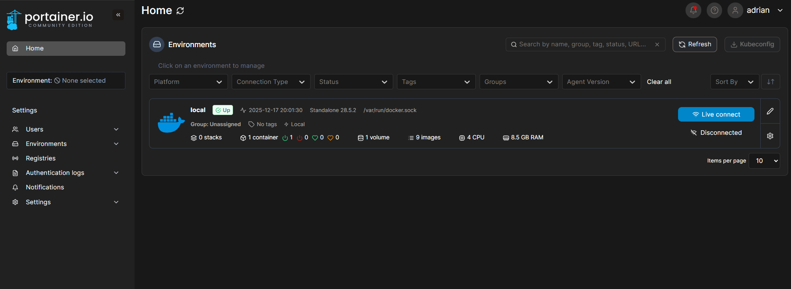
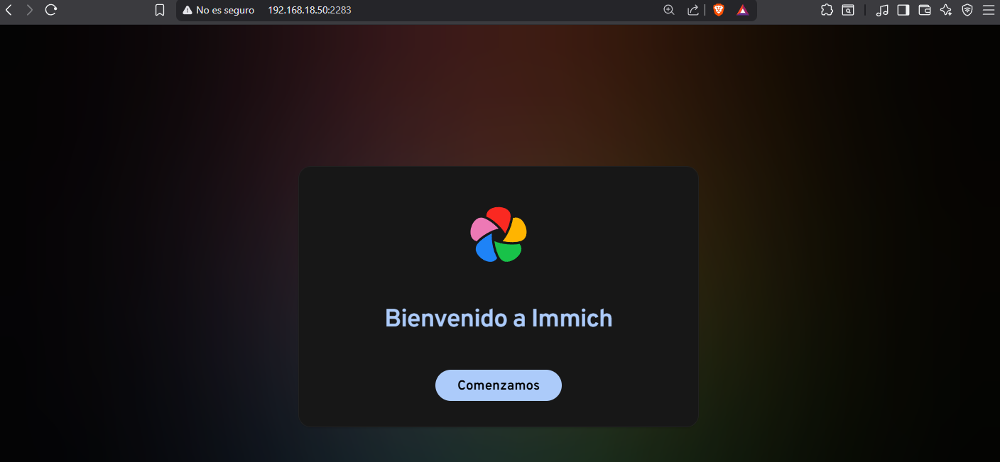

# Raspberry Pi 5 - Proyectos y Configuraciones

Este repositorio contiene diferentes proyectos y configuraciones que estoy implementando en mi Raspberry Pi 5. Aquí documentaré el proceso de instalación y configuración de diversos servicios self-hosted.

---

## 📋 Contenido

- [Instalación de Portainer](#instalación-de-portainer)
- [Instalación de Immich](#instalación-de-immich)
- [Servidor VPN](#servidor-vpn) *(Próximamente)*
- [Otros proyectos](#otros-proyectos) *(En desarrollo)*

---

## 🐳 Instalación de Portainer

Portainer es una herramienta de gestión para Docker que facilita la administración de contenedores, imágenes, volúmenes y redes a través de una interfaz web intuitiva.

### Pasos de instalación:

1. **Crear un volumen para Portainer:**
   ```bash
   docker volume create portainer_data
   ```

2. **Ejecutar el contenedor de Portainer:**
   ```bash
   docker run -d -p 8000:8000 -p 9443:9443 \
     --name portainer --restart=always \
     -v /var/run/docker.sock:/var/run/docker.sock \
     -v portainer_data:/data \
     portainer/portainer-ce:latest
   ```

3. **Acceder a Portainer:**
   - Abre tu navegador y ve a: `https://<IP-de-tu-maquina>:9443`
   - Crea tu cuenta de administrador en el primer acceso

### Resultado:



---

## 📸 Instalación de Immich

Immich es una solución self-hosted para backup de fotos y vídeos, similar a Google Photos. A continuación se detallan los pasos de instalación siguiendo la [documentación oficial](https://docs.immich.app/install/docker-compose/).

### Pasos de instalación:

1. **Descargar el archivo docker-compose:**
   ```bash
   wget -O docker-compose.yml https://github.com/immich-app/immich/releases/latest/download/docker-compose.yml
   ```

2. **Descargar el archivo de variables de entorno:**
   ```bash
   wget -O .env https://github.com/immich-app/immich/releases/latest/download/example.env
   ```

3. **Editar el archivo .env (opcional pero recomendado):**
   ```bash
   nano .env
   ```
   Modifica las siguientes variables según tus necesidades:
   - `UPLOAD_LOCATION`: Ruta donde se almacenarán tus fotos
   - `DB_PASSWORD`: Contraseña para la base de datos

4. **Crear la carpeta para las bibliotecas (opcional):**
   ```bash
   mkdir -p /path/to/your/library
   ```

5. **Iniciar los contenedores:**
   ```bash
   docker compose up -d
   ```

6. **Verificar que los contenedores estén ejecutándose:**
   ```bash
   docker compose ps
   ```

7. **Acceder a Immich:**
   - Abre tu navegador y ve a: `http://<IP-de-tu-maquina>:2283`
   - Crea tu cuenta de administrador en el primer acceso

### Resultado:



---

## 🔒 Servidor VPN

*Sección en desarrollo. Próximamente se añadirá la configuración de un servidor VPN.*

---

## 🚀 Otros proyectos

*Esta sección irá creciendo con más proyectos y servicios implementados en la Raspberry Pi 5.*

---

## 📝 Notas

- Asegúrate de tener Docker y Docker Compose instalados
- Recuerda ajustar las rutas y configuraciones según tu entorno específico
- Mantén siempre actualizados tus contenedores para garantizar la seguridad

---
